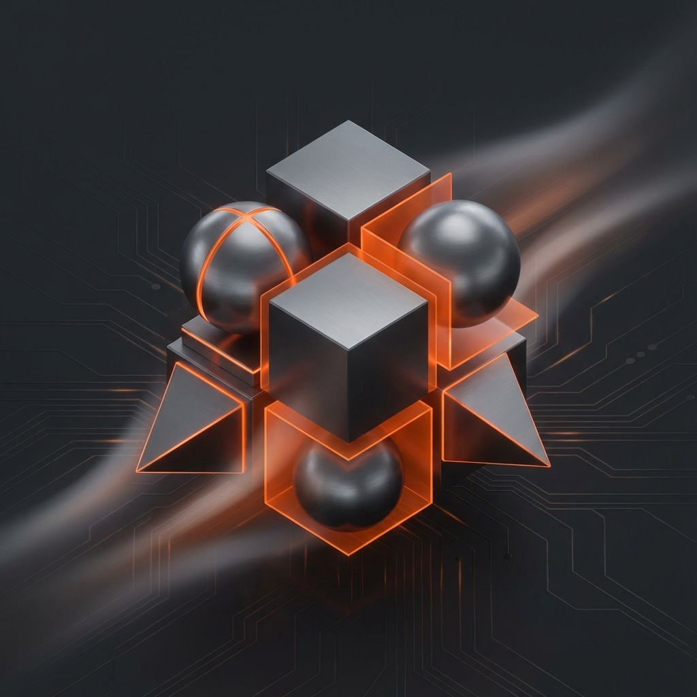

# ClintUX

The ultimate centralized management interface for server infrastructure, Docker containers, and self-hosted applications. Built for simplicity, security, and premium aesthetics.



## Table of Contents

1.  [Features](#features)
2.  [Technology Stack](#technology-stack)
3.  [Architecture Overview](#architecture-overview)
4.  [Customization](#customization)
5.  [Installation & Execution](#installation--execution)
6.  [Credits](#credits)

---

## Features

-   **Real-Time Monitoring**: Live visualization of CPU, RAM, Disk, and Network usage using efficient Python bridges.
-   **Docker Management**:
    -   List running/stopped containers.
    -   Start, Stop, and Restart actions directly from the UI.
    -   Create new lightweight containers (e.g., Nginx, Alpine).
-   **Application Hub**: Centralized launcher for all your self-hosted apps (Plex, Portainer, Pi-hole, etc.) with reverse proxy support.
-   **Secure Authentication**: Role-based access control (Admin/User), audit logging, and brutal-force protection.
-   **Persistent Dark Mode**: Adaptive UI that respects user preference across sessions and devices.
-   **Responsive Design**: Mobile-first glassmorphism interface built with TailwindCSS.

## Technology Stack

-   **Backend**: Laravel 11 (PHP 8.2+)
-   **Frontend**: Blade Templates, TailwindCSS, Alpine.js (Lightweight interactivity)
-   **System Integration**: Python 3 scripts (for hardware stats & Docker CLI interaction)
-   **Database**: SQLite (Default) or MySQL/MariaDB
-   **Containerization**: Docker & Docker Compose

## Architecture Overview

ClintUX follows a **Model-View-Controller (MVC)** pattern with a specialized "Bridge" layer:

1.  **Frontend (Blade/Alpine)**: Renders the UI and polls the backend for live data.
2.  **Laravel Backend**: Handles auth, routing, and business logic.
3.  **Python Bridge**:
    -   Laravel executes Python scripts via `Process`.
    -   Python scripts interacts with the Host OS (via `psutil` or `docker-py`) to fetch privileged data.
    -   Data is returned as JSON to Laravel for display.

This decoupled approach ensures the web server stays lightweight while accessing low-level system metrics securely.

## Customization

You can customize the dashboard by editing the `.env` file after installation:

| Parameter     | Description                            | Default             |
| :------------ | :------------------------------------- | :------------------ |
| `APP_NAME`    | The name displayed in the header/title | "ClintUX"           |
| `APP_DOMAIN`  | Domain shown in the admin panel        | "myserver.com"      |
| `ADMIN_EMAIL` | Default admin email for seeding        | "admin@example.com" |

## Installation & Execution

The project is designed to be "Clone & Run".

### Prerequisites

-   **Docker** and **Docker Compose** installed on the host machine.

### Quick Start

1.  **Clone the Repository**

    ```bash
    git clone https://github.com/Mario-conf/dashboard.git
    cd dashboard
    ```

2.  **Launch with Docker Compose**

    ```bash
    docker-compose up -d --build
    ```

    _The system will automatically:_

    -   Build the containers.
    -   Install PHP/Python dependencies.
    -   Setup the database and run migrations.
    -   Serve the app at `http://localhost:8000`.

3.  **Access ClintUX**
    -   **URL**: `http://localhost:8000`
    -   **Default Login**:
        -   Email: `admin@example.com`
        -   Password: `password`

---

## Credits

-   **Author & Developer**: [Mario.conf](https://github.com/Mario-conf)
-   **Cover Art**: Custom Abstract 3D Design by Mario.conf

## License

The MIT License (MIT).
